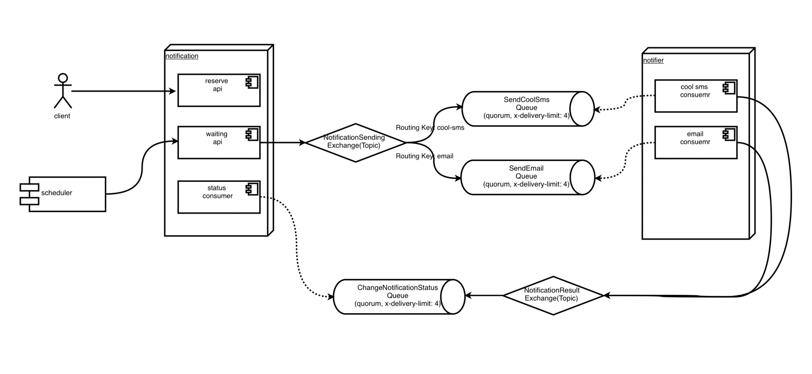

# notification

### 개발환경
- Java 17
- Spring Boot 3.2.3
- Spring Batch
- Spring Data JPA
- Spring Cloud OpenFeign
- Spring AMQP
- Gradle
- H2

### MODULE

1. 클라이언트는 예약 알림 등록 API를 호출한다.
2. 스케줄러는 예약 시간이 된 예약된 알림을 대기 상태로 변경하는 API를 5초마다 호출한다.
3. 예약된 알림을 대기 상태로 변경하는 API는 대상들을 조회 후 발송 대기 상태로 변경하여 DB에 업데이트 한다. 동시에, 대상 알림들을 발송 대기 메시지 큐에 전송한다.
4. 발송 서비스의 발송 대기 큐 컨슈머는 큐에 들어온 대상을 실제 발송 처리를 한 후 결과를 알림 상태 변경 큐에 전송한다.
5. 알림 서비스의 상태 변경 큐 컨슈머는 큐에 들어온 대상을 상태 변경 처리 후 DB에 업데이트 한다.

### CLASS DIAGRAM

### API

[알림 예약]
- POST http://localhost:8090/api/notifications
  - -H ContentType: application/json

[예약 알림 발송]
- POST http://localhost:8090/api/notifications/reserved-sending
    - -H ContentType: application/json
